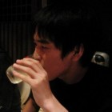
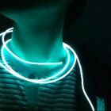

<!doctype html>
<meta charset="UTF-8">
<title>アカデミックパック</title>
<link href="stylesheets/markdown.css" rel="stylesheet"></link>

Hello, students.

---

## Projects
- 裾メモリー (第20回 国際学生対抗バーチャルリアリティコンテスト ユース部門)

---

## Members
### YamazaGi
<http://github.com/YamazaGi/>
### masnnuller
<http://github.com/masnnuller/>
### jackale
<http://github.com/jackale/>
### 7taku1
<http://github.com/7taku1/>
### mactkg
<http://github.com/mactkg/>

---
<http://github.com/AcademicPack/>
